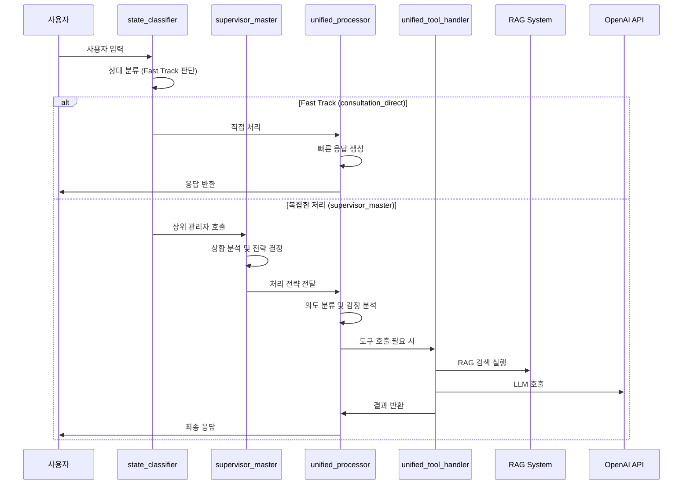
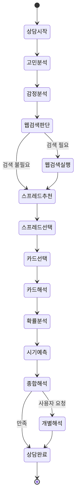
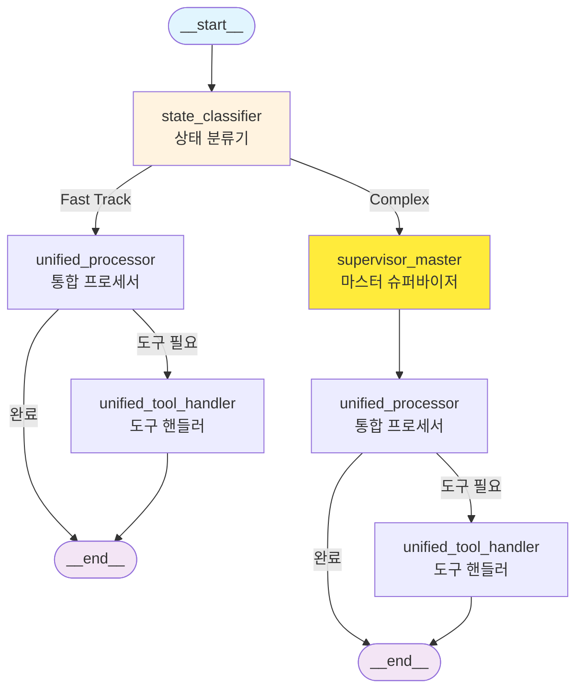
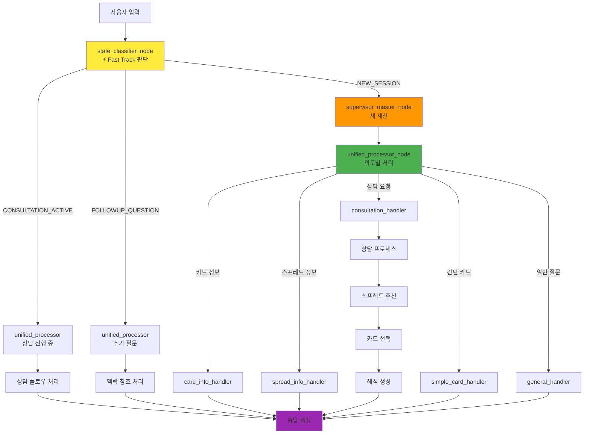
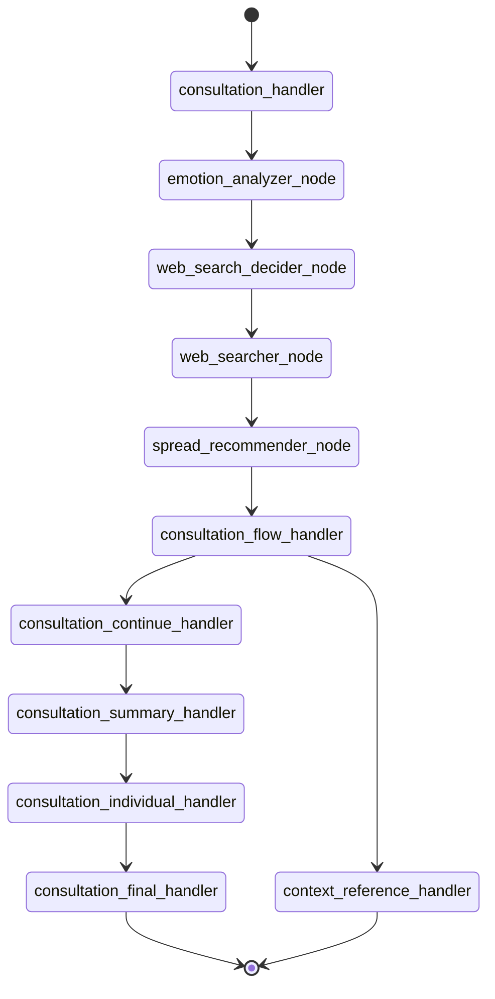
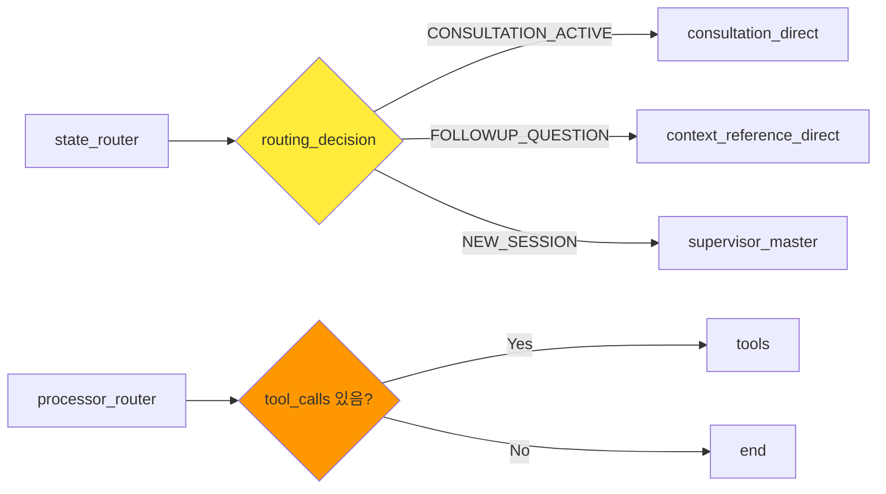
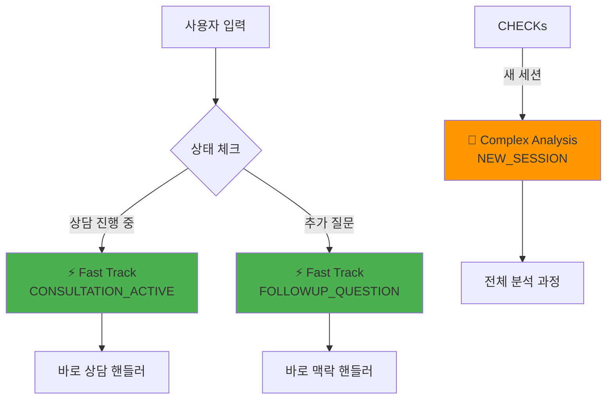

# 🔮 타로 에이전트 시스템 아키텍처 문서

**작성일**: 2024.07.06  
**버전**: v1.0  
**작성자**: AI Assistant  

---

## 📋 목차

1. [시스템 개요](#시스템-개요)
2. [전체 아키텍처](#전체-아키텍처)
3. [핵심 컴포넌트](#핵심-컴포넌트)
4. [모듈별 상세 분석](#모듈별-상세-분석)
5. [데이터 플로우](#데이터-플로우)
6. [성능 최적화](#성능-최적화)
7. [확장성 고려사항](#확장성-고려사항)

---

## 🎯 시스템 개요

타로 에이전트 시스템은 **LangGraph 기반의 고도화된 타로 상담 AI 시스템**으로, 다음과 같은 핵심 특징을 가집니다:

### 🔑 핵심 특징
- **LangGraph 기반**: 상태 기반 워크플로우 관리
- **RAG 시스템 통합**: FAISS + BM25 + FlashRank 하이브리드 검색
- **웹 검색 통합**: Tavily + DuckDuckGo 실시간 정보 연동
- **감정 분석**: 사용자 감정 상태 기반 맞춤형 응답
- **확률 계산**: 과학적 접근법 기반 타로 해석
- **멀티턴 대화**: 상담 맥락 유지 및 연속성 보장

### 🏗️ 시스템 구조
```
parsing/parser/tarot_agent/
├── agent.py                 # 메인 에이전트 및 그래프 정의
├── __init__.py             # 패키지 초기화
└── utils/                  # 유틸리티 모듈
    ├── state.py            # 상태 관리 (TarotState)
    ├── nodes.py            # 노드 함수들 (2327줄)
    ├── helpers.py          # 헬퍼 함수들 (1500줄)
    ├── analysis.py         # 분석 모듈 (384줄)
    ├── timing.py           # 시간 예측 모듈 (247줄)
    ├── web_search.py       # 웹 검색 모듈 (509줄)
    ├── translation.py      # 번역 모듈 (181줄)
    ├── tools.py            # RAG 도구 (56줄)
    └── __init__.py         # 유틸리티 패키지 초기화
```

---

## 🏛️ 전체 아키텍처

### 시스템 아키텍처 다이어그램

```mermaid
graph TB
    %% 타로 에이전트 시스템 아키텍처
    
    subgraph "🔮 타로 에이전트 시스템"
        START([시작])
        
        subgraph "📊 상태 관리 (TarotState)"
            STATE[["messages: List[BaseMessage]<br/>user_intent: Literal<br/>user_input: str<br/>consultation_data: Dict<br/>supervisor_decision: Dict<br/>routing_decision: str<br/>target_handler: str<br/>needs_llm: bool<br/>session_memory: Dict<br/>conversation_memory: Dict<br/>temporal_context: Dict<br/>search_results: Dict"]]
        end
        
        subgraph "🎯 메인 워크플로우"
            CLASSIFIER[state_classifier_node<br/>상태 분류기]
            SUPERVISOR[supervisor_master_node<br/>마스터 관리자]
            PROCESSOR[unified_processor_node<br/>통합 처리기]
            TOOL_HANDLER[unified_tool_handler_node<br/>도구 처리기]
        end
        
        subgraph "🔍 라우팅 시스템"
            STATE_ROUTER{state_router<br/>상태 라우터}
            PROCESSOR_ROUTER{processor_router<br/>처리기 라우터}
        end
        
        subgraph "🧠 핵심 노드 모듈 (nodes.py)"
            INTENT_CLASSIFIER[classify_intent_node<br/>의도 분류]
            EMOTION_ANALYZER[emotion_analyzer_node<br/>감정 분석]
            WEB_SEARCH_DECIDER[web_search_decider_node<br/>웹 검색 결정]
            WEB_SEARCHER[web_searcher_node<br/>웹 검색 실행]
            SPREAD_RECOMMENDER[spread_recommender_node<br/>스프레드 추천]
            SITUATION_ANALYZER[situation_analyzer_node<br/>상황 분석]
            CARD_COUNT_INFERRER[card_count_inferrer_node<br/>카드 수 추론]
            STATUS_DETERMINER[status_determiner_node<br/>상태 결정]
        end
        
        subgraph "🎭 핸들러 모듈"
            CARD_INFO_HANDLER[card_info_handler<br/>카드 정보 처리]
            SPREAD_INFO_HANDLER[spread_info_handler<br/>스프레드 정보 처리]
            SIMPLE_CARD_HANDLER[simple_card_handler<br/>간단 카드 처리]
            CONSULTATION_HANDLER[consultation_handler<br/>상담 처리]
            GENERAL_HANDLER[general_handler<br/>일반 처리]
            UNKNOWN_HANDLER[unknown_handler<br/>알 수 없는 처리]
            CONSULTATION_FLOW_HANDLER[consultation_flow_handler<br/>상담 플로우 처리]
            CONSULTATION_CONTINUE_HANDLER[consultation_continue_handler<br/>상담 계속 처리]
            CONSULTATION_SUMMARY_HANDLER[consultation_summary_handler<br/>상담 요약 처리]
            CONSULTATION_INDIVIDUAL_HANDLER[consultation_individual_handler<br/>개별 상담 처리]
            CONSULTATION_FINAL_HANDLER[consultation_final_handler<br/>상담 완료 처리]
            CONTEXT_REFERENCE_HANDLER[context_reference_handler<br/>맥락 참조 처리]
            EXCEPTION_HANDLER[exception_handler<br/>예외 처리]
            EMOTIONAL_SUPPORT_HANDLER[emotional_support_handler<br/>감정 지원 처리]
            START_SPECIFIC_SPREAD_CONSULTATION[start_specific_spread_consultation<br/>특정 스프레드 상담 시작]
            TOOL_RESULT_HANDLER[tool_result_handler<br/>도구 결과 처리]
        end
        
        subgraph "🛠️ 유틸리티 모듈"
            subgraph "helpers.py"
                HELPERS[["convert_numpy_types()<br/>safe_format_search_results()<br/>parse_card_numbers()<br/>select_cards_randomly()<br/>translate_card_info()<br/>analyze_emotion_and_empathy()<br/>generate_empathy_message()<br/>extract_concern_keywords()<br/>perform_multilayer_spread_search()<br/>TAROT_CARDS 정의"]]
            end
            
            subgraph "analysis.py"
                ANALYSIS[["calculate_card_draw_probability()<br/>calculate_success_probability_from_cards()<br/>analyze_card_combination_synergy()<br/>analyze_elemental_balance()<br/>calculate_numerological_significance()<br/>generate_integrated_analysis()<br/>analyze_emotion_and_empathy()"]]
            end
            
            subgraph "timing.py"
                TIMING[["get_current_context()<br/>calculate_days_until_target()<br/>integrate_timing_with_current_date()<br/>ensure_temporal_context()<br/>predict_timing_from_card_metadata()"]]
            end
            
            subgraph "web_search.py"
                WEB_SEARCH[["initialize_search_tools()<br/>perform_web_search()<br/>decide_web_search_need_with_llm()<br/>extract_relevant_keywords()<br/>filter_korean_results()<br/>integrate_search_results_with_tarot()"]]
            end
            
            subgraph "translation.py"
                TRANSLATION[["translate_text_with_llm()<br/>translate_card_info()<br/>translate_korean_to_english_with_llm()"]]
            end
            
            subgraph "tools.py"
                TOOLS[["initialize_rag_system()<br/>search_tarot_spreads()<br/>search_tarot_cards()"]]
            end
        end
        
        subgraph "🔗 외부 시스템 연동"
            RAG_SYSTEM[TarotRAGSystem<br/>RAG 검색 시스템]
            OPENAI_API[OpenAI API<br/>GPT-4o/4o-mini]
            TAVILY_API[Tavily API<br/>웹 검색]
            DUCKDUCKGO_API[DuckDuckGo API<br/>웹 검색]
        end
        
        END([종료])
    end
    
    %% 워크플로우 연결
    START --> CLASSIFIER
    CLASSIFIER --> STATE_ROUTER
    STATE_ROUTER -->|consultation_direct| PROCESSOR
    STATE_ROUTER -->|context_reference_direct| PROCESSOR
    STATE_ROUTER -->|supervisor_master| SUPERVISOR
    SUPERVISOR --> PROCESSOR
    PROCESSOR --> PROCESSOR_ROUTER
    PROCESSOR_ROUTER -->|tools| TOOL_HANDLER
    PROCESSOR_ROUTER -->|end| END
    TOOL_HANDLER --> END
    
    %% 상태 연결
    STATE -.-> CLASSIFIER
    STATE -.-> SUPERVISOR
    STATE -.-> PROCESSOR
    STATE -.-> TOOL_HANDLER
    
    %% 노드 모듈 연결
    PROCESSOR -.-> INTENT_CLASSIFIER
    PROCESSOR -.-> EMOTION_ANALYZER
    PROCESSOR -.-> WEB_SEARCH_DECIDER
    PROCESSOR -.-> WEB_SEARCHER
    PROCESSOR -.-> SPREAD_RECOMMENDER
    PROCESSOR -.-> SITUATION_ANALYZER
    PROCESSOR -.-> CARD_COUNT_INFERRER
    PROCESSOR -.-> STATUS_DETERMINER
    
    %% 핸들러 연결
    PROCESSOR -.-> CARD_INFO_HANDLER
    PROCESSOR -.-> SPREAD_INFO_HANDLER
    PROCESSOR -.-> SIMPLE_CARD_HANDLER
    PROCESSOR -.-> CONSULTATION_HANDLER
    PROCESSOR -.-> GENERAL_HANDLER
    PROCESSOR -.-> UNKNOWN_HANDLER
    PROCESSOR -.-> CONSULTATION_FLOW_HANDLER
    PROCESSOR -.-> CONSULTATION_CONTINUE_HANDLER
    PROCESSOR -.-> CONSULTATION_SUMMARY_HANDLER
    PROCESSOR -.-> CONSULTATION_INDIVIDUAL_HANDLER
    PROCESSOR -.-> CONSULTATION_FINAL_HANDLER
    PROCESSOR -.-> CONTEXT_REFERENCE_HANDLER
    PROCESSOR -.-> EXCEPTION_HANDLER
    PROCESSOR -.-> EMOTIONAL_SUPPORT_HANDLER
    PROCESSOR -.-> START_SPECIFIC_SPREAD_CONSULTATION
    PROCESSOR -.-> TOOL_RESULT_HANDLER
    
    %% 유틸리티 연결
    PROCESSOR -.-> HELPERS
    PROCESSOR -.-> ANALYSIS
    PROCESSOR -.-> TIMING
    PROCESSOR -.-> WEB_SEARCH
    PROCESSOR -.-> TRANSLATION
    TOOL_HANDLER -.-> TOOLS
    
    %% 외부 시스템 연결
    TOOLS -.-> RAG_SYSTEM
    PROCESSOR -.-> OPENAI_API
    WEB_SEARCHER -.-> TAVILY_API
    WEB_SEARCHER -.-> DUCKDUCKGO_API
```



---

## 🔧 핵심 컴포넌트

### 1. 📊 상태 관리 (TarotState)

```python
class TarotState(TypedDict):
    """최적화된 타로 상태"""
    # 기본 메시지 관리
    messages: Annotated[List[BaseMessage], add_messages]
    # 사용자 의도 (핵심!)
    user_intent: Literal["card_info", "spread_info", "consultation", "general", "simple_card", "unknown"]
    user_input: str
    # 상담 전용 데이터
    consultation_data: Optional[Dict[str, Any]]
    # Supervisor 관련 필드
    supervisor_decision: Optional[Dict[str, Any]]
    # 라우팅 관련
    routing_decision: Optional[str]
    target_handler: Optional[str]
    needs_llm: Optional[bool]
    # 세션 메모리
    session_memory: Optional[Dict[str, Any]]
    conversation_memory: Optional[Dict[str, Any]]
    # 시간 맥락 정보
    temporal_context: Optional[Dict[str, Any]]
    search_timestamp: Optional[str]
    # 웹 검색 관련 필드
    search_results: Optional[Dict[str, Any]]
    search_decision: Optional[Dict[str, Any]]
```

### 2. 🎯 메인 워크플로우

#### 최적화된 그래프 구조
```python
def create_optimized_tarot_graph():
    """🆕 최적화된 타로 그래프 - 기존 함수들 100% 재사용"""
    workflow = StateGraph(TarotState)
    
    # 핵심 노드 추가
    workflow.add_node("state_classifier", state_classifier_node)
    workflow.add_node("supervisor_master", supervisor_master_node)
    workflow.add_node("unified_processor", unified_processor_node)
    workflow.add_node("unified_tool_handler", unified_tool_handler_node)
    
    # 워크플로우 정의
    workflow.add_edge(START, "state_classifier")
    workflow.add_conditional_edges(
        "state_classifier",
        state_router,
        {
            "consultation_direct": "unified_processor",
            "context_reference_direct": "unified_processor",
            "supervisor_master": "supervisor_master"
        }
    )
    workflow.add_edge("supervisor_master", "unified_processor")
    workflow.add_conditional_edges(
        "unified_processor",
        processor_router,
        {
            "tools": "unified_tool_handler",
            "end": END
        }
    )
    workflow.add_edge("unified_tool_handler", END)
    
    return workflow
```

### 3. 🔍 라우팅 시스템

#### Fast Track 최적화
- **consultation_direct**: 활성 상담 중 빠른 처리
- **context_reference_direct**: 맥락 참조 직접 처리
- **supervisor_master**: 복잡한 상황 분석 필요

---

## 📁 모듈별 상세 분석

### 1. 🧠 nodes.py (2,327줄)

**핵심 노드 함수들**:

#### 분류 및 분석 노드
- `state_classifier_node`: 상태 분류
- `classify_intent_node`: 의도 분류
- `emotion_analyzer_node`: 감정 분석
- `situation_analyzer_node`: 상황 분석
- `card_count_inferrer_node`: 카드 수 추론
- `status_determiner_node`: 상태 결정

#### 검색 및 추천 노드
- `web_search_decider_node`: 웹 검색 필요성 판단
- `web_searcher_node`: 웹 검색 실행
- `spread_recommender_node`: 스프레드 추천
- `spread_extractor_node`: 스프레드 추출

#### 상담 처리 핸들러
- `consultation_handler`: 메인 상담 처리
- `consultation_flow_handler`: 상담 플로우 관리
- `consultation_continue_handler`: 상담 계속 처리
- `consultation_summary_handler`: 상담 요약 처리
- `consultation_individual_handler`: 개별 카드 해석
- `consultation_final_handler`: 상담 완료 처리

#### 정보 제공 핸들러
- `card_info_handler`: 카드 정보 제공
- `spread_info_handler`: 스프레드 정보 제공
- `simple_card_handler`: 간단 카드 처리
- `general_handler`: 일반 질문 처리
- `unknown_handler`: 알 수 없는 입력 처리

#### 특수 처리 핸들러
- `context_reference_handler`: 맥락 참조 처리
- `exception_handler`: 예외 상황 처리
- `emotional_support_handler`: 감정 지원 처리
- `start_specific_spread_consultation`: 특정 스프레드 상담 시작
- `tool_result_handler`: 도구 결과 처리

### 2. 🛠️ helpers.py (1,500줄)

**핵심 유틸리티 함수들**:

#### 데이터 처리
- `convert_numpy_types()`: NumPy 타입 변환
- `safe_format_search_results()`: 검색 결과 안전 포맷팅
- `parse_card_numbers()`: 카드 번호 파싱
- `select_cards_randomly_but_keep_positions()`: 랜덤 카드 선택

#### 타로 시스템
- `TAROT_CARDS`: 78장 타로 카드 정의
- `translate_card_info()`: 카드 정보 번역
- `extract_concern_keywords()`: 고민 키워드 추출
- `perform_multilayer_spread_search()`: 다층 스프레드 검색

#### 감정 분석
- `analyze_emotion_and_empathy()`: 감정 분석
- `generate_empathy_message()`: 공감 메시지 생성
- `check_if_has_specific_concern()`: 구체적 고민 여부 판단

#### 성능 최적화
- `performance_monitor()`: 성능 모니터링 데코레이터
- `create_optimized_consultation_flow()`: 최적화된 상담 플로우
- `create_smart_routing_system()`: 스마트 라우팅 시스템
- `create_quality_assurance_system()`: 품질 보증 시스템
- `create_advanced_error_recovery()`: 고급 오류 복구

### 3. 📊 analysis.py (384줄)

**과학적 분석 함수들**:

#### 확률 계산
- `calculate_card_draw_probability()`: 하이퍼기하분포 기반 카드 확률
- `calculate_success_probability_from_cards()`: 카드 기반 성공 확률
- `analyze_card_combination_synergy()`: 카드 조합 시너지 분석

#### 원소 분석
- `analyze_elemental_balance()`: 원소 균형 분석
- `generate_elemental_interpretation()`: 원소 해석 생성

#### 수비학 분석
- `calculate_numerological_significance()`: 수비학적 의미 분석
- `generate_integrated_analysis()`: 통합 분석
- `generate_integrated_recommendation()`: 통합 추천

#### 감정 분석
- `analyze_emotion_and_empathy()`: 감정 상태 분석
- `generate_empathy_message()`: 감정 기반 공감 메시지

### 4. ⏰ timing.py (247줄)

**시간 예측 함수들**:

#### 시간 맥락
- `get_current_context()`: 현재 시간 맥락 생성
- `get_weekday_korean()`: 한국어 요일 변환
- `get_season()`: 계절 정보
- `calculate_days_until_target()`: 목표 날짜까지 일수 계산

#### 타이밍 예측
- `predict_timing_from_card_metadata()`: 카드 메타데이터 기반 시기 예측
- `predict_timing_with_current_date()`: 현재 날짜 기반 시기 예측
- `integrate_timing_with_current_date()`: 시기 분석과 현재 날짜 통합
- `ensure_temporal_context()`: 시간 맥락 보장

### 5. 🌐 web_search.py (509줄)

**웹 검색 함수들**:

#### 검색 도구 초기화
- `initialize_search_tools()`: 검색 도구 초기화 (Tavily + DuckDuckGo)
- `perform_web_search()`: 웹 검색 실행
- `decide_web_search_need_with_llm()`: LLM 기반 웹 검색 필요성 판단

#### 검색 결과 처리
- `extract_relevant_keywords()`: 관련 키워드 추출
- `filter_korean_results()`: 한국어 결과 필터링
- `integrate_search_results_with_tarot()`: 검색 결과와 타로 통합
- `format_search_results_for_display()`: 검색 결과 표시 포맷팅

### 6. 🌍 translation.py (181줄)

**번역 함수들**:

#### 텍스트 번역
- `translate_text_with_llm()`: LLM 기반 텍스트 번역
- `translate_card_info()`: 카드 정보 번역
- `translate_korean_to_english_with_llm()`: 한국어→영어 번역

### 7. 🔧 tools.py (56줄)

**RAG 도구 함수들**:

#### RAG 시스템
- `initialize_rag_system()`: RAG 시스템 초기화
- `search_tarot_spreads()`: 타로 스프레드 검색
- `search_tarot_cards()`: 타로 카드 검색

---

## 📊 데이터 플로우

### 1. 사용자 입력 처리 플로우



### 2. 상담 플로우



---

## ⚡ 성능 최적화

### 1. Fast Track 시스템

**목적**: 멀티턴 대화에서 응답 속도 최적화

**구현**:
- 상담 진행 중 간단한 질문은 `consultation_direct` 경로로 빠른 처리
- 복잡한 분석이 필요한 경우만 `supervisor_master` 경로 사용
- 라우팅 결정에 따라 처리 시간 표시 (`Fast Track` vs `Full Analysis`)

### 2. 병렬 처리

**구현된 병렬 처리**:
```python
def parallel_emotion_and_search_analysis(state: TarotState) -> TarotState:
    """감정 분석과 웹 검색 판단을 병렬로 실행"""
    with ThreadPoolExecutor(max_workers=2) as executor:
        emotion_future = executor.submit(analyze_emotion_and_empathy, user_input)
        search_future = executor.submit(web_search_decider_node, state)
        
        emotion_result = emotion_future.result()
        search_result = search_future.result()
        
        return {**state, **emotion_result, **search_result}
```

### 3. 캐싱 시스템

**스프레드 검색 캐싱**:
```python
def cached_spread_search(state: TarotState) -> TarotState:
    """캐시된 스프레드 검색"""
    cache_key = f"spread_search_{hash(user_input)}"
    cached_result = state.get("spread_cache", {}).get(cache_key)
    
    if cached_result:
        return cached_result
    
    # 캐시 없으면 실제 검색 실행
    result = spread_recommender_node(state)
    # 캐시에 저장
    return result
```

### 4. 성능 모니터링

**실행 시간 측정**:
```python
@performance_monitor
def function_name(*args, **kwargs):
    # 함수 실행 시간 자동 측정 및 출력
    pass
```

---

## 🔧 확장성 고려사항

### 1. 모듈러 설계

**장점**:
- 각 모듈이 독립적으로 개발/테스트 가능
- 새로운 기능 추가 시 기존 코드 영향 최소화
- 유지보수 용이성

### 2. 상태 기반 아키텍처

**TarotState의 확장성**:
- 새로운 필드 추가 시 기존 코드 호환성 유지
- Optional 타입 사용으로 점진적 기능 추가 가능

### 3. 외부 시스템 통합

**현재 통합된 시스템**:
- OpenAI API (GPT-4o/4o-mini)
- Tavily API (웹 검색)
- DuckDuckGo API (웹 검색)
- TarotRAGSystem (내부 RAG)

**확장 가능한 통합**:
- 다른 LLM 모델 (Claude, Gemini 등)
- 추가 검색 엔진
- 외부 타로 데이터베이스
- 음성 인식/합성 시스템

### 4. 품질 보증 시스템

**자동 품질 검증**:
```python
def validate_consultation_quality(state: TarotState) -> dict:
    """상담 품질 검증"""
    quality_score = 0.0
    issues = []
    
    # 메시지 품질, 감정 지원, 전문성 등 검증
    # 품질 점수 0.7 이상 통과
    
    return {
        "quality_score": quality_score,
        "issues": issues,
        "passed": quality_score >= 0.7
    }
```

### 5. 오류 복구 시스템

**우아한 폴백 처리**:
```python
def graceful_fallback(state: TarotState, error: Exception) -> TarotState:
    """우아한 폴백 처리"""
    # 오류 유형별 맞춤 응답
    if "LLM" in str(error):
        fallback_message = "🔮 잠시 마음을 가다듬고 있어요. 다시 한 번 말씀해주시겠어요?"
    elif "search" in str(error):
        fallback_message = "🔮 검색 중 문제가 있었지만, 기본 지식으로 도움을 드릴 수 있어요."
    
    return {"messages": [AIMessage(content=fallback_message)]}
```

---

## 📈 시스템 메트릭스

### 코드 규모
- **총 라인 수**: 약 5,000줄
- **핵심 모듈**: nodes.py (2,327줄), helpers.py (1,500줄)
- **지원 모듈**: 6개 (analysis, timing, web_search, translation, tools, state)

### 기능 범위
- **핸들러 함수**: 16개
- **분석 노드**: 8개
- **유틸리티 함수**: 50개 이상
- **외부 API 통합**: 4개

### 성능 특성
- **Fast Track**: 상담 중 빠른 응답 (< 2초)
- **Full Analysis**: 복잡한 분석 (2-5초)
- **병렬 처리**: 감정 분석 + 웹 검색 동시 실행
- **캐싱**: 스프레드 검색 결과 캐싱

---

## 🎯 결론

타로 에이전트 시스템은 **LangGraph 기반의 고도화된 상태 관리**와 **모듈러 아키텍처**를 통해 확장성과 유지보수성을 확보한 시스템입니다. 

**주요 강점**:
1. **Fast Track 최적화**로 멀티턴 대화 성능 향상
2. **과학적 접근법** (확률 계산, 원소 분석, 수비학)
3. **실시간 웹 검색** 통합으로 현실적 조언 제공
4. **감정 분석** 기반 맞춤형 응답
5. **품질 보증** 및 **오류 복구** 시스템

이 아키텍처는 타로 상담의 전문성을 유지하면서도 현대적인 AI 기술을 효과적으로 활용한 혁신적인 시스템입니다.

---

**문서 버전**: v1.0  
**최종 업데이트**: 2024.07.06  
**다음 업데이트 예정**: 성능 벤치마크 및 사용자 만족도 분석 추가 


---
아! 기존 타로 에이전트 파일들을 분석해서 Mermaid 다이어그램으로 그려드리겠습니다.
Read file: parsing/parser/tarot_agent/agent.py
Read file: parsing/parser/tarot_agent/utils/nodes.py
기존 타로 에이전트의 구조를 분석해서 Mermaid 다이어그램으로 그려드리겠습니다.

## 🔮 **타로 에이전트 실제 구조 - Mermaid**

### **메인 워크플로우**


### **상세 노드 구조**


### **상담 플로우 상세**


### **핵심 라우팅 구조**


### **Fast Track 시스템**


이게 실제 타로 에이전트의 **정확한 구조**입니다! 🎯