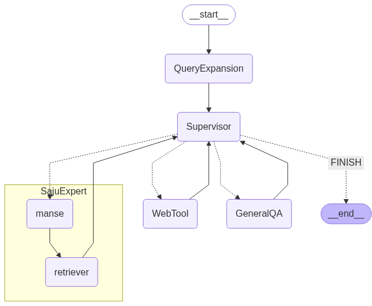

# 그래프구조

# manse tool
- manse_6.py : 만세툴
- manse_7.py : 윤달 적용 만세툴
- manse_7.py: prompt떄문인지 갑자기 100점만점을 나오는 오류. 따라서 8점 만점으로 수정

# node 노트북
- saju_agentic_rag4.ipynb: 각 노드별 실험이 있는 ipynb (Query_expansin)
- saju_agentic_rag5.ipynb: 각 노드별 실험이 있는, 바리게이트 노드가 추가된 ipynb(Query_expansin, Barricade)
- saju_agentic_rag6.ipynb: 노드만 있는 ipynb! (실험x, Query_expansin)
- saju_agentic_rag7.ipynb: 만세력을 잘 가져오지 못하는 문제를 해결하기 위해 노드 구조 수정

# main
(수정되기 직전의 노드가 것들(saju_agentic_rag7))
- saju_agentic_rag.py : 랭그래프를 py화 한것
- saju_agentic_rag2.py: chat_history 리스트를 직접 만들어서 관리. supervisor 프롬프트 약간 수정
- saju_agentic_rag3.py:  chat_history 리스트를 집적 만들어 관리. Supervisor 프롬프트: 라우팅 규칙을 훨씬 더 명확하고 엄격하게 변경했습니다.

예를 들어, "ManseTool 다음에는 반드시 RetrieverTool을 호출해야 한다" 와 같은 강력한 규칙을 추가하여 에이전트의 행동을 더 정교하게 제어해야 한다.

# 노드수정 main (manse + retriever)
(수정된 노드가 들어간 것(saju_agentic_rag7))
saju_agent_main.py: 최종 답변만을 불러오기 위한 파이썬 파일(토큰을 아끼기 위해노드마다 실행을 생략, 수정된 노드)

- ipynb에서 발생하지 않던 오류들 발생
    -> saju_agentic_rag코드에선 자꾸 웹툴로 빠지는 문제.
    -> 계속 질문을 하면 처음에는 생년월일 및 만세력, 사주오행을 올바르게 가져오지만, 나중에는 만세력, 사주오행을 제대로 반영하지 못하는 문제.

saju_agent_main

ex) 
SajuExpert로 만들어, manse_tool과 retriever를 하나로 묶음.

1995년 9월 22일 남자, 15시 30분
을해 을유 병진 을미

1996년 12월 13일 남자, 10시 30분
병자 경자 갑신 경오

1997년 9월 1일 여자, 11시 30분
정축 무신 병오 계사

1995년 7월 03일 남자, 16시 30분
을해 임오 을미 갑신

1995년 3월 28일 남자, 12시 30분 출생
을해 기묘 무오 무오

1995년 9월 25일~10월 23일 (윤달)
1995년 윤8월 26일 오후 3시 30분 남자 - 을해 을유 기축 신미
1995년 8월 26일 오후 3시 30분 남자