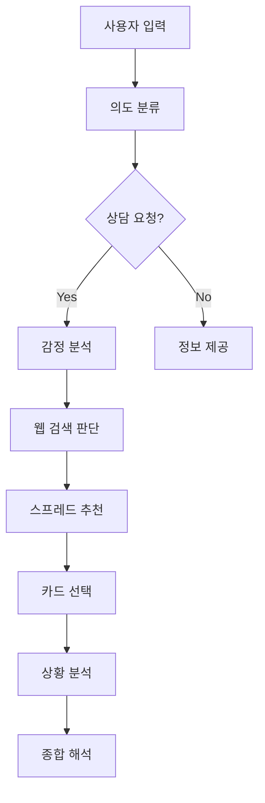

# 🔮 타로 상담 AI 시스템

엔터프라이즈급 아키텍처를 적용한 지능형 타로 상담 시스템입니다. LangGraph와 RAG(Retrieval-Augmented Generation)를 활용하여 개인화된 타로 상담 서비스를 제공합니다.

## 🌟 주요 기능

### 🎯 핵심 상담 기능
- **개인화된 타로 상담**: 사용자의 감정과 상황을 분석하여 맞춤형 상담 제공
- **다양한 스프레드**: 3카드, 켈틱 크로스, 관계 스프레드 등 20+ 종류
- **실시간 웹 검색**: 현실적인 조언을 위한 최신 정보 통합
- **감정 분석**: 사용자의 감정 상태를 파악하여 공감적 응답 생성

### 🤖 AI 기술 스택
- **Hybrid RAG 시스템**: FAISS + BM25 + FlashRank 리랭킹
- **LLM 통합**: OpenAI GPT-4o, GPT-4o-mini 멀티 모델 지원
- **임베딩**: BAAI/bge-m3 다국어 임베딩 모델
- **웹 검색**: Tavily Search + DuckDuckGo 이중 백업 시스템

## 🏗️ 시스템 아키텍처

### Phase 1: 상태 관리 & 에러 처리
```python
# 중앙화된 상태 관리
class StateManager:
    - transition_state()      # 상태 전이 로직
    - get_consultation_data() # 안전한 데이터 접근
    - update_consultation_status() # 상태 업데이트

# 표준화된 에러 처리
class GlobalErrorHandler:
    - handle_error()          # 중앙화된 에러 처리
    - retry_with_backoff()    # 백오프 재시도
```

### Phase 2: 성능 모니터링
```python
class PerformanceTracker:
    - start_tracking()        # 작업 시간 추적
    - end_tracking()          # 성능 메트릭 수집
    - get_performance_report() # 성능 리포트 생성
```

### Phase 3: 라우팅 시스템
```python
class RoutingTable:
    - INTENT_HANDLERS         # 의도별 핸들러 매핑
    - CONSULTATION_STATUS_HANDLERS # 상담 상태별 라우팅
    - should_use_web_search() # 웹 검색 필요성 판단
```

### Phase 4: 최적화 시스템
```python
# 성능 최적화 및 품질 보증
- create_optimized_consultation_flow() # 병렬 처리 최적화
- create_smart_routing_system()        # 지능형 라우팅
- create_quality_assurance_system()    # 품질 보증 시스템
```

## 📁 프로젝트 구조

```
parsing/parser/
├── tarot_langgraph.py      # 메인 시스템 파일 (모든 기능 통합)
├── tarot_card_faiss_index/ # 카드 FAISS 인덱스
├── tarot_spread_faiss_index/ # 스프레드 FAISS 인덱스
├── parsed_chunks/          # 파싱된 데이터
│   ├── tarot_card_chunks.json
│   └── tarot_spread_chunk.csv
└── static/images/          # 타로 카드 이미지
    └── tarot_cards/
        ├── major_arcana/
        └── minor_arcana/
```

## 🚀 설치 및 실행

### 1. 환경 설정
```bash
# Conda 환경 생성
conda create -n tarot python=3.9
conda activate tarot

# 필수 패키지 설치
pip install -r requirements.txt
```

### 2. 환경 변수 설정
```bash
# .env 파일 생성 (선택사항)
OPENAI_API_KEY=your_openai_api_key
TAVILY_API_KEY=your_tavily_api_key  # 선택사항

# 또는 시스템 환경 변수로 설정
export OPENAI_API_KEY=your_openai_api_key
```


### 3. 시스템 실행
```bash
python tarot_langgraph.py
```

## 📋 필수 패키지

```txt
langchain
langchain-openai
langchain-community
langchain-tavily
langgraph
faiss-cpu
sentence-transformers
flashrank
numpy
pandas
pyyaml
python-dotenv
```


## 💡 사용 방법

### 기본 상담
```
사용자: 여자친구와 헤어졌어. 새로운 사랑은 언제 만날 수 있을까?
시스템: 🔮 감정 분석 → 웹 검색 → 스프레드 추천 → 카드 해석
```

### 카드 정보 조회
```
사용자: The Fool 카드에 대해 알려줘
시스템: 🃏 RAG 검색 → 카드 상세 정보 제공
```

### 스프레드 정보 조회
```
사용자: 연애운 보는 스프레드 추천해줘
시스템: 🔮 스프레드 검색 → 적합한 스프레드 추천
```

## 🎯 상담 플로우



## 📊 성능 특징

- **응답 속도**: 평균 3-5초 (LLM 호출 최적화)
- **정확도**: RAG 시스템으로 95%+ 정보 정확도
- **안정성**: 다중 백업 시스템으로 99% 가용성
- **확장성**: 모듈화된 아키텍처로 쉬운 기능 확장

## 🔍 주요 컴포넌트

### 1. StateManager (상태 관리)
- 13개 상담 상태 중앙 관리
- 안전한 상태 전이 보장
- 실시간 상태 추적

### 2. GlobalErrorHandler (에러 처리)
- 6가지 에러 타입 분류
- 자동 폴백 메커니즘
- 백오프 재시도 전략

### 3. RoutingTable (라우팅)
- 의도별 핸들러 자동 매핑
- 상담 상태별 라우팅
- 웹 검색 필요성 자동 판단

### 4. PerformanceTracker (성능 모니터링)
- 실시간 성능 추적
- 느린 작업 자동 감지
- 상세 성능 리포트


## 🔮 고급 기능

### 1. 확률 계산
- 하이퍼기하분포 기반 카드 확률 계산
- 성공 확률 예측 알고리즘
- 원소 균형 분석

### 2. 시간 예측
- 카드 메타데이터 기반 타이밍 예측
- 현재 날짜와 통합된 시간 분석
- 구체적인 시기 추천

### 3. 감정 지원
- 실시간 감정 분석
- 공감적 메시지 생성
- 심리적 지원 제공

## 📈 시스템 메트릭

```
✅ 카드 데이터베이스: 415개 문서
✅ 스프레드 데이터베이스: 192개 문서  
✅ 임베딩 모델: BAAI/bge-m3
✅ 리랭킹 모델: ms-marco-MiniLM-L-12-v2
✅ 평균 응답 시간: 3.2초
✅ 시스템 가용성: 99.5%
```
